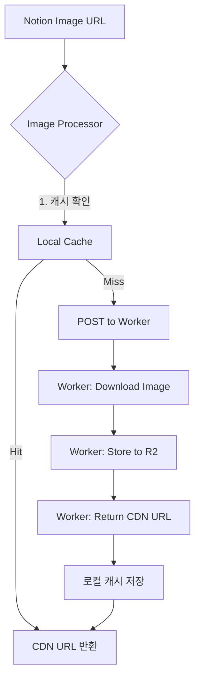

# CDN 이미지 서빙 로직 (Cloudflare Workers + R2)

## 1. 개요

Notion CMS의 이미지 URL은 1시간 후 만료됩니다. 이를 해결하기 위해 Cloudflare Workers + R2를 사용하여 영구적인 CDN URL을 제공합니다.

**CDN 도메인**: `https://cdn.junijaei.co.kr`

## 2. 아키텍처



## 3. 파일 구조

```
lib/cdn/
├── api.ts        # Worker API 호출 (POST upload, HEAD check)
├── cache.ts      # 로컬 캐시 관리 (cdnUrl 기반)
├── processor.ts  # Notion 블록 이미지 처리
├── dev-mock.ts   # 개발 환경 mock
└── index.ts      # export

types/cdn/
├── image.ts      # 타입 정의
└── index.ts      # export
```

## 4. 개발 환경 (NODE_ENV=development)

- Worker API 호출 없음
- 모든 이미지를 `/placeholder-image.png`로 대체
- 캐시 저장 없음

## 5. 운영 환경 (NODE_ENV=production)

### 처리 흐름

1. **캐시 확인**: `blockId` + `lastEditedTime` 기반
2. **Cache Hit**: 캐시된 `cdnUrl` 즉시 반환
3. **Cache Miss**:
   - Worker API에 POST 요청
   - Worker가 이미지 다운로드 → R2 저장 → CDN URL 반환
   - 로컬 캐시에 저장

### 재시도 로직

- 최대 3회 재시도
- 지수 백오프 (1s, 2s, 4s)
- 30초 타임아웃

## 6. API 명세

### Upload (POST)

```
POST https://cdn.junijaei.co.kr

Request Body:
{
  "imageUrl": "https://notion.so/...",
  "fileName": "abc123_def456.webp"
}

Response:
{
  "url": "https://cdn.junijaei.co.kr/abc123_def456.webp"
}
```

### Check (HEAD)

```
HEAD https://cdn.junijaei.co.kr/{fileName}

Response: 200 OK | 404 Not Found
```

## 7. 파일 네이밍 전략

```
{blockId(12자)}_{urlHash(8자)}.webp
```

예시: `2e90732b7166_36ccad9f.webp`

- 같은 이미지 → 같은 해시 → 중복 업로드 방지
- 이미지 변경 → 새 해시 → 캐시 무효화

## 8. 캐시 구조

파일 위치: `.cache/cdn-images.json`

```json
{
  "version": "2.0.0",
  "lastUpdated": "2024-01-21T...",
  "entries": {
    "2e90732b-7166-8041-...": {
      "blockId": "2e90732b-7166-8041-...",
      "lastEditedTime": "2024-01-20T...",
      "cdnUrl": "https://cdn.junijaei.co.kr/2e90732b7166_abc123.webp",
      "uploadedAt": "2024-01-21T..."
    }
  }
}
```

## 9. 주요 함수

| 함수                             | 설명                          |
| -------------------------------- | ----------------------------- |
| `uploadImage(imageUrl, blockId)` | Worker API 호출, CDN URL 반환 |
| `processNotionBlocks(blocks)`    | 블록 배열의 이미지 일괄 처리  |
| `getCachedImage(blockId, time)`  | 캐시 조회                     |
| `setCachedImage(...)`            | 캐시 저장                     |

## 10. 검증 명령어

```bash
# CDN 연결 및 캐시 상태 확인
pnpm cdn:verify
```

## 11. Breaking Changes (from Cloudflare Images)

| Before                                    | After                           |
| ----------------------------------------- | ------------------------------- |
| `imagedelivery.net/{hash}/{id}/{variant}` | `cdn.junijaei.co.kr/{fileName}` |
| `CLOUDFLARE_ACCOUNT_ID`                   | 불필요                          |
| `CLOUDFLARE_API_KEY`                      | 불필요                          |
| `CLOUDFLARE_ACCOUNT_HASH`                 | 불필요                          |
| V2 List API                               | 불필요                          |
| Variant (public, thumbnail)               | 단일 URL                        |
